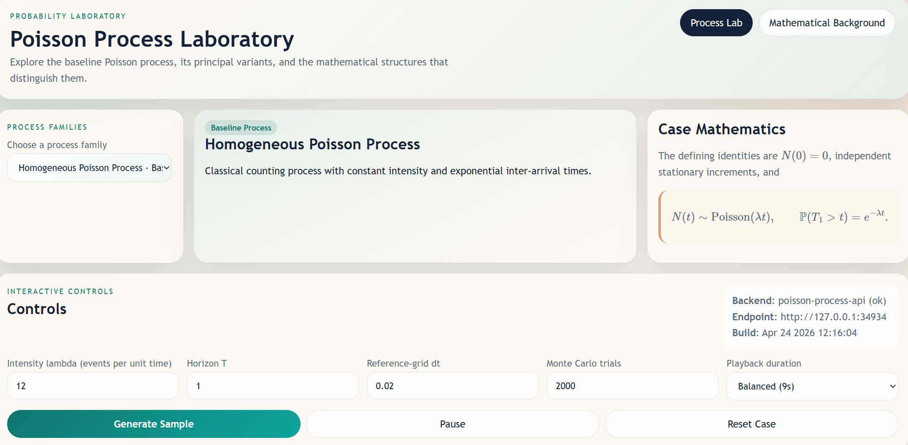
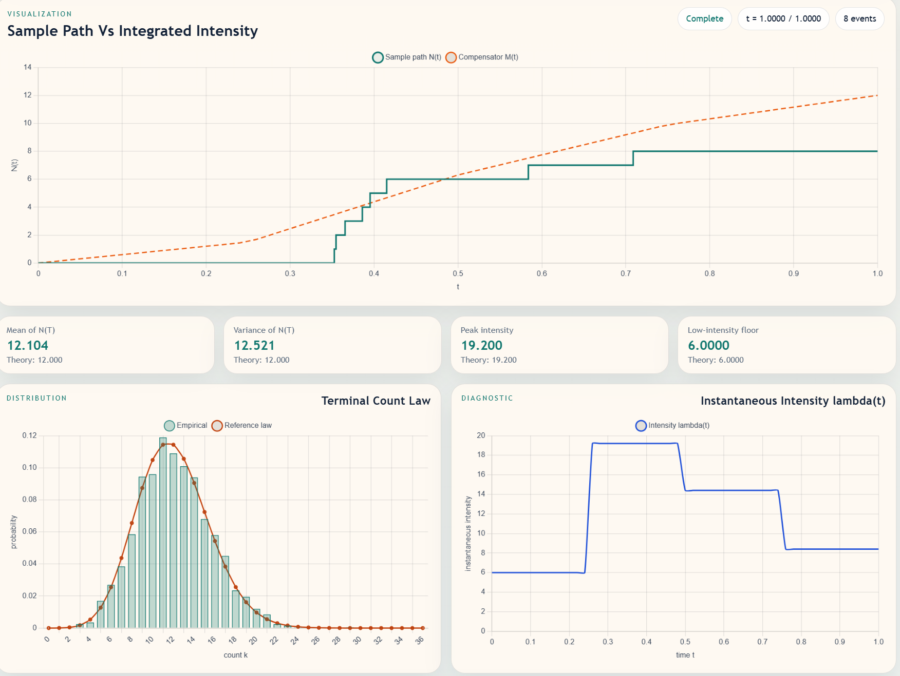
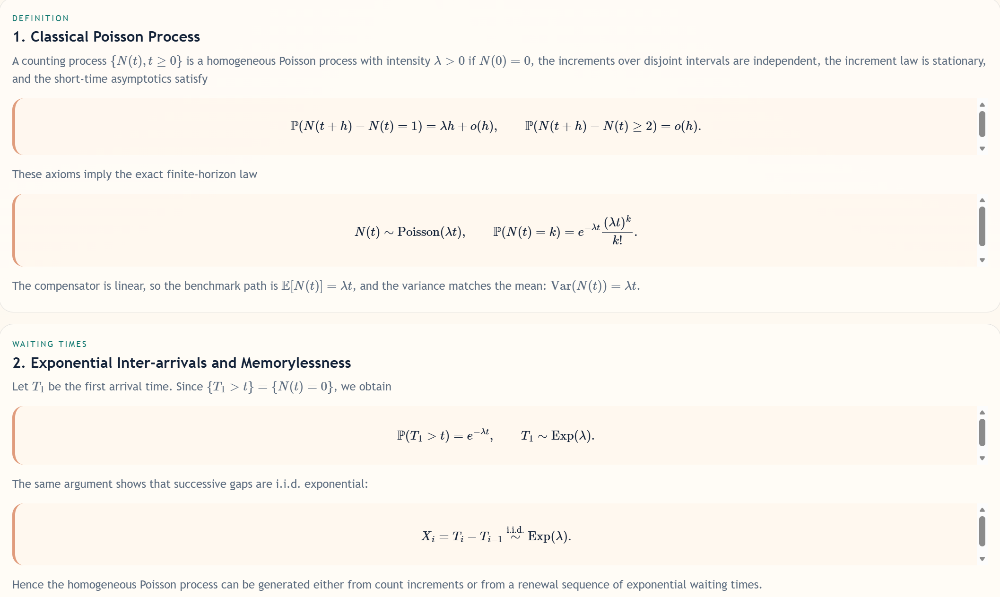

# Poisson Process Laboratory

Poisson Process Laboratory 是一个用于学习泊松过程及其常见扩展的本地交互式网站。项目把“数学定义、随机模拟、统计检验、可视化解释”放在同一个页面里：用户可以选择过程类型、调整参数、生成样本路径，并把经验分布与理论分布放在同一张图中比较。



## 1. 项目定位

这个项目面向概率论、随机过程、排队论、保险精算、事件驱动系统建模等教学场景。它不只是展示公式，而是把每个公式落到可运行的模拟流程中：

- 用样本路径观察到达过程、跳跃过程或空间点过程。
- 用 Monte Carlo 试验比较经验均值、方差、概率质量函数或密度。
- 用诊断图展示等待时间、强度函数、跳跃大小、潜在强度或空间占用数。
- 用数学背景页整理定义、分布恒等式和典型推广。

## 2. 数学原理

### 2.1 齐次泊松过程

齐次泊松过程 $\{N(t), t \ge 0\}$ 是最基础的计数过程。它满足：

- $N(0)=0$；
- 不相交时间区间上的增量相互独立；
- 增量分布只依赖区间长度；
- 短时间内发生一次事件的概率约为 $\lambda h$，发生两次及以上事件的概率为 $o(h)$。

因此有核心分布：

$$
N(t) \sim \operatorname{Poisson}(\lambda t),
\qquad
\mathbb{P}(N(t)=k)=e^{-\lambda t}\frac{(\lambda t)^k}{k!}.
$$

相邻到达间隔服从指数分布：

$$
T_i-T_{i-1}\stackrel{i.i.d.}{\sim}\operatorname{Exp}(\lambda).
$$

在网站中，齐次过程的样本路径是一条阶梯函数，理论基准线是线性补偿子 $\mathbb{E}[N(t)] = \lambda t$。

### 2.2 非齐次泊松过程

非齐次泊松过程把常数强度 $\lambda$ 推广为随时间变化的强度函数 $\lambda(t)$。关键对象是补偿子：

$$
M(t)=\int_0^t \lambda(s)\,ds.
$$

终端计数不再由 $\lambda t$ 控制，而是由累计强度控制：

$$
N(t)\sim \operatorname{Poisson}(M(t)),
\qquad
\mathbb{E}[N(t)] = \operatorname{Var}(N(t)) = M(t).
$$

网站支持预设强度曲线，也支持用公式或画布手绘自定义强度轮廓。可视化中，样本路径会与 $M(t)$ 对照，而诊断图会展示瞬时强度 $\lambda(t)$。



### 2.3 复合泊松过程

复合泊松过程在每次到达时附加随机跳跃大小 $J_i$：

$$
S(t)=\sum_{i=1}^{N(t)}J_i.
$$

它适合描述保险赔付总额、网络包总负载、累计损失等“事件次数随机、单次影响也随机”的系统。均值和方差为：

$$
\mathbb{E}[S(t)] = \lambda t\,\mathbb{E}[J],
\qquad
\operatorname{Var}(S(t)) = \lambda t\,\mathbb{E}[J^2].
$$

网站中默认跳跃大小使用 Gamma 型分布，也可以通过公式或手绘方式指定非负密度曲线，后端会自动归一化并据此采样。

### 2.4 混合泊松过程

混合泊松过程把强度本身设为随机变量 $\Lambda$。在给定 $\Lambda$ 的条件下，它仍然是齐次泊松过程：

$$
N(t)\mid\Lambda \sim \operatorname{Poisson}(\Lambda t).
$$

边际化之后，计数方差会超过均值：

$$
\operatorname{Var}(N(T))
= \mathbb{E}[\Lambda]T+\operatorname{Var}(\Lambda)T^2.
$$

这类模型适合描述隐藏环境状态、个体异质性或过度离散的计数数据。默认混合分布为 Gamma 型，因此终端计数对应负二项结构；用户也可以编辑潜在强度的密度曲线。

### 2.5 空间泊松过程

空间泊松过程把时间长度替换为空间测度。对观测区域 $A$ 中任意可测子区域 $B$：

$$
N(B)\sim\operatorname{Poisson}(\lambda |B|),
\qquad
\mathbb{E}[N(A)] = \operatorname{Var}(N(A)) = \lambda |A|.
$$

网站支持 2D 窗口和 3D 体积两种展示方式。主图展示随机点模式，分布图展示网格单元占用数，诊断图展示总点数分布。

### 2.6 数学背景页

数学背景页把定义、等待时间、补偿子、复合过程、混合过程和空间过程放在同一条逻辑线上，适合课堂讲解或自学时查阅。



## 3. 计算机技术栈

### 3.1 后端：C++17 随机模拟 API

后端位于 `backend/`，核心职责是生成模拟数据并返回前端可直接绘图的 JSON：

- C++17：实现随机过程模拟、直方图、理论曲线和统计摘要。
- `cpp-httplib`：提供轻量 HTTP 服务。
- `nlohmann/json`：序列化 API 请求和响应。
- CMake：构建 `poisson_server.exe`。

主要接口：

- `GET /api/health`：返回服务状态、构建时间和可用过程类型。
- `GET /api/cases`：返回前端过程选择器所需的案例元数据。
- `POST /api/simulate/process`：根据参数运行模拟，返回路径、直方图、诊断曲线、统计指标和解释文本。

后端模拟方法包括：

- 齐次泊松过程：指数等待时间采样。
- 非齐次泊松过程：thinning 接受-拒绝算法。
- 复合泊松过程：泊松到达叠加随机跳跃大小。
- 混合泊松过程：先采样潜在强度，再条件采样路径。
- 空间泊松过程：先采样区域总点数，再在窗口内均匀撒点。
- 自定义曲线：对前端传入的非负曲线进行排序、裁剪、线性插值、积分归一化和 CDF 反演采样。

### 3.2 前端：原生 Web 交互界面

前端位于 `frontend/`，没有引入大型框架，使用原生 HTML/CSS/JavaScript 模块组织：

- `frontend/index.html`：页面结构、视图切换、Canvas 容器。
- `frontend/styles/main.css`：实验室风格布局、控制面板、图表容器和响应式样式。
- `frontend/scripts/app.js`：状态管理、API 请求、动画播放、参数同步、自定义曲线编辑。
- `frontend/scripts/charts.js`：Chart.js 图表封装。
- `frontend/scripts/content.js`：不同过程类型的文案、公式和数学背景页内容。
- `frontend/scripts/scenes.js`：图表或空间场景辅助逻辑。

前端使用的关键库：

- Chart.js：绘制样本路径、经验分布、理论分布、诊断曲线。
- MathJax：渲染页面中的 LaTeX 数学公式。
- Canvas API：支持自定义强度函数、跳跃大小密度和混合强度密度的手绘编辑。
- Fetch API：调用本地 C++ 后端服务。

### 3.3 启动脚本与本地运行

根目录下的 `start.ps1` 会自动完成本地启动：

- 根据项目路径选择稳定的高位端口，减少多个本地项目之间的端口冲突。
- 构建并启动 C++ 后端。
- 启动 Python 静态文件服务器托管前端。
- 自动用 `apiBase` 查询参数把前端连接到实际后端端口。

## 4. 快速运行

### 4.1 一键启动（推荐）

在 Windows PowerShell 中运行：

```powershell
powershell -ExecutionPolicy Bypass -File .\start.ps1
```

如需指定端口：

```powershell
.\start.ps1 -ApiPort 8081 -FrontendPort 5501
```

### 4.2 手动构建后端

在 Visual Studio Developer PowerShell 或 Developer Command Prompt 中运行：

```powershell
cmake -S backend -B backend/build -G "NMake Makefiles"
cmake --build backend/build
backend/build/poisson_server.exe
```

后端默认监听：

```text
http://127.0.0.1:8080
```

也可以通过环境变量指定端口：

```powershell
$env:POISSON_API_PORT = "8081"
backend/build/poisson_server.exe
```

### 4.3 手动启动前端

```powershell
python -m http.server 5500
```

然后访问：

```text
http://127.0.0.1:5500/frontend/?apiBase=http%3A%2F%2F127.0.0.1%3A8080
```

## 5. 目录结构

```text
backend/                 C++ API 服务与随机模拟核心
  src/
    case_models.hpp       过程类型元数据
    poisson_simulator.*   模拟器、统计量、理论曲线
    main.cpp              HTTP API 入口

frontend/                原生 Web 前端
  index.html
  scripts/
  styles/

docs/                    API、案例和数学推导补充文档
images/                  README 与功能说明截图
start.ps1                Windows 本地一键启动脚本
```